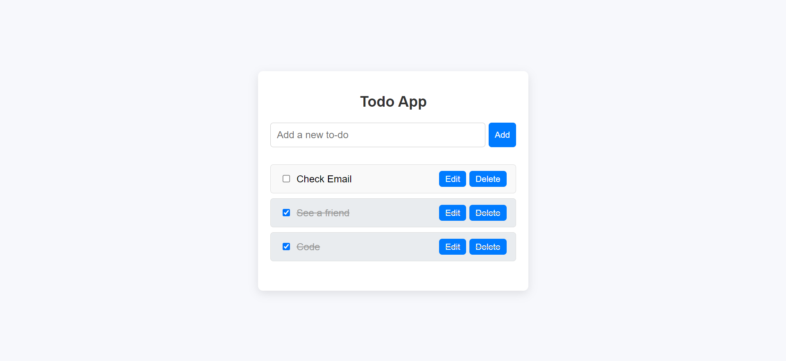
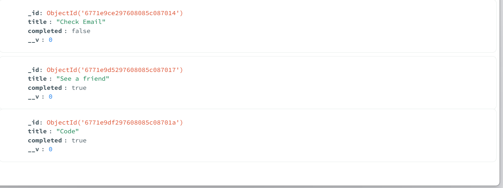

**Todo App**
=====================

**Overview**
------------

The Todo App is a simple web application that allows users to create, read, update, and delete (CRUD) todo items. The app is built using Node.js, Express.js, and MongoDB, with a frontend built using HTML, CSS, and JavaScript.

**Features**
------------

* Create new todo items with a title and completed status
* Read all todo items, including their title and completed status
* Update existing todo items, including their title and completed status
* Delete existing todo items
* Display a loading animation while data is being fetched or updated

**Database**
------------

The Todo App uses a MongoDB database to store todo items. The database schema is defined in `models/todo.js` and includes the following fields:

* `title`: a string representing the title of the todo item
* `completed`: a boolean representing the completed status of the todo item

**Frontend**
------------

The frontend of the Todo App is built using HTML, CSS, and JavaScript. The main entry point is `public/index.html`, which includes the following features:

* A form to create new todo items
* A list to display all todo items, including their title and completed status
* Buttons to update and delete existing todo items
* A loading animation while data is being fetched or updated

**Backend**
------------

The backend of the Todo App is built using Node.js and Express.js. The main entry point is `index.js`, which includes the following features:

* API endpoints to create, read, update, and delete todo items
* Database connection using MongoDB
* Error handling and logging

**Running the App**
-------------------

To run the Todo App, follow these steps:

### Backend

1. Install dependencies by running `npm install` in the root directory
2. Start the server by running `node index.js` in the root directory
3. The server will start on port 3000, and you can access the API endpoints by visiting `http://localhost:3000/api/todos` in your web browser

### Frontend

1. Open `public/index.html` in your web browser
2. The frontend will connect to the backend API endpoints to fetch and update data

**Screenshots**
--------------

Here is a screenshot of the Todo App in action:

**Database Screenshot**
----------------------

Here is a screenshot of the MongoDB database:

**API Endpoints**
----------------

Here are the API endpoints for the Todo App:

* `GET /api/todos`: fetch all todo items
* `POST /api/todos`: create a new todo item
* `PUT /api/todos/:id`: update an existing todo item
* `DELETE /api/todos/:id`: delete an existing todo item

I hope this README helps! Let me know if you have any questions or need further clarification.